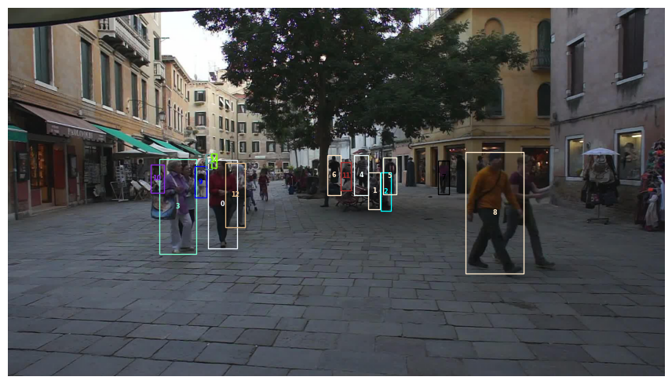

# ReID-GNN-based-Pedestrian-Tracking
This repository mainly contains two contents: one is using ReID to model the appearance of the pedestrians, the other is to build a tracker based on Neural Message Passing (GNN).  

## Introduction
These two methods are part of exercises for the lecture Computer Vision 3: Detection, Segmentation and Tracking. The goal of both exercises is to track pedestrians in the sequence of viedo using [MOT16](https://motchallenge.net/data/MOT16/) dataset.
Before beginning the two main files `ReID_exercise`and `GNN_exercise`, please follow all instructions of `exercise 0`.

## ReID: appearance-based tracking
The ReID exercise investigates appearance-based tracking by training a `ReID network`. What we did is:

- to implement Hungarian matching in the tracker.
- to train a small ReID dataset with cross-entropy and triplet-loss.
- to apply the trained ReID network on the detected MOT16 bounding boxes.

But before tracking, we used Faster R-CNN with a Resnet50 feature extractor as the object detector to detect pedestrians.

See tracking examples：

## GNN-based tracking
The tracker above has an obvious limitation: whenever a track cannot be matched with the detections of a given frame the track will be killed. This means that if our detector misses an object in a single frame (due to e.g. occlusion), we will not be able to recover that track, and we will start a new one. 

To fix this issue, in GNN exercise, we firstly introduce a `patient` variable to implement `Long-Term ReID Tracker`, which has a better performance.

Some limits of the `Long-Term ReID Tracker`:
- It relies solely on appearance to predict similarity scores between objects. This can be problematic whenever appearance alone may not discriminative, and it'd be best to also take into account object position and size attributes. 
- Our tracker can only account for pairwise similarities among objects. Ideally, we would like it to also consider higher-order information.

Therefore, we build a tracker that will combine both appearance and position information with a Message Passing Neural Network, which has a better performance.